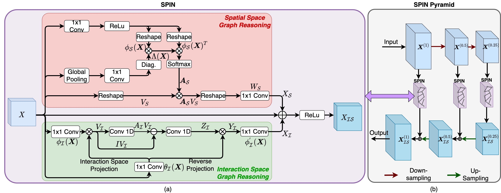

## SPIN Road Mapper: Extracting Roads from Aerial Images via Spatial and Interaction Space Graph Reasoning for Autonomous Driving
[Wele Gedara Chaminda Bandara](https://www.linkedin.com/in/chamindabandara/), [Jeya Maria Jose Valanarasu](https://jeya-maria-jose.github.io/research/), and [Vishal M. Patel](https://engineering.jhu.edu/vpatel36/sciencex_teams/vishalpatel/)

Preprint submitted to IEEE International Conference on Robotics and Automation.

## Abstract
Road extraction is an essential step in building autonomous navigation systems. Detecting road segments is challenging as they are of varying widths, bifurcated throughout the image, and are often occluded by terrain, cloud, or other weather conditions. Using just convolution neural networks (ConvNets) for this problem is not effective as it is inefficient at capturing distant dependencies between road segments in the image which is essential to extract road connectivity. To this end, we propose a Spatial and Interaction Space Graph Reasoning (SPIN) module which when plugged into a ConvNet performs reasoning over graphs constructed on spatial and interaction spaces projected from the feature maps. Reasoning over spatial space extracts dependencies between different spatial regions and other contextual information. Reasoning over a projected interaction space helps in appropriate delineation of roads from other topographies present in the image. Thus, SPIN extracts long-range dependencies between road segments and effectively delineates roads from other semantics. We also introduce a SPIN pyramid which performs SPIN graph reasoning across multiple scales to extract multi-scale features. We propose a network based on stacked hourglass modules and SPIN pyramid for road segmentation which achieves better performance compared to existing methods. Moreover, our method is computationally efficient and significantly boosts the convergence speed during training, making it feasible for applying on large-scale high-resolution aerial images.

## Proposed SPIN (Spatial + Interaction Space) Graph Reasoning Module

