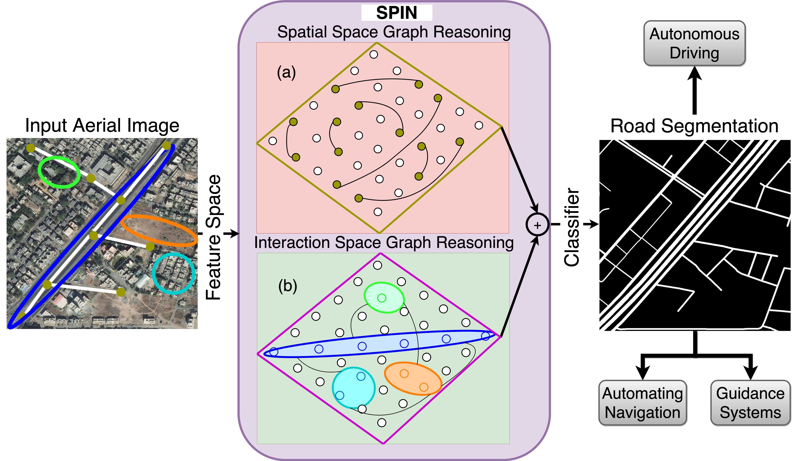

## SPIN Road Mapper: Extracting Roads from Aerial Images via Spatial and Interaction Space Graph Reasoning for Autonomous Driving
[Wele Gedara Chaminda Bandara](https://www.linkedin.com/in/chamindabandara/), [Jeya Maria Jose Valanarasu](https://jeya-maria-jose.github.io/research/), and [Vishal M. Patel](https://engineering.jhu.edu/vpatel36/sciencex_teams/vishalpatel/)

Under review at IEEE International Conference on Robotics and Automation (ICRA), 2022.

## Overview of proposed SPIN module

We build graphs in two spaces: (a) spatial space and (b) a projected latent interaction space from feature maps. Graph reasoning in spatial space extracts connectivity between the road segments, whereas reasoning over interaction space delineates roads from other topographies. Nodes connected with lines in (a) denote how road segments are modeled to understand connectivity in the spatial space. Regions marked with different colors in (b) denote how different semantics are segregated for better road delineation in the interaction space.

## Architecture of proposed SPIN module and SPIN pyramid

